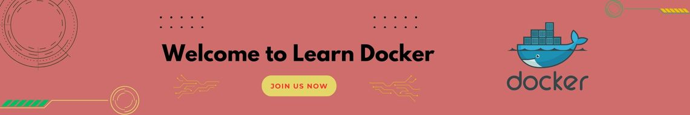

# <div align="center">[Welcome to Docker Tutorial](./Learn-Docker.md)

</div>

## [The topics covered in this repository](Learn-Docker.md)
- What is Docker?
- How to Installation?
- What is Docker Container?
- What is Docker images?
- How to create images?
- How to pull docker image?
- How to run container?
- How to start and stop container?
- What is Dockerfile?

## How to Contribute 
 Contribution is the best way to get involve and support community! If you enjoyed learning then dont't forget to hit ⭐

[fork the Repo](https://github.com/shivam-sharma7/Learn-Docker/fork)

Clone the Repo

```
git clone https://github.com/your_username/Learn-Docker.git

```

Navigate into directory

```
cd Learn-Docker

```

Create new Branch

```
git checkout -b <branch_name>

```
Made changes what you want to add or improve and push your changes and Open a PR

```
git push origin <your_branch>

```